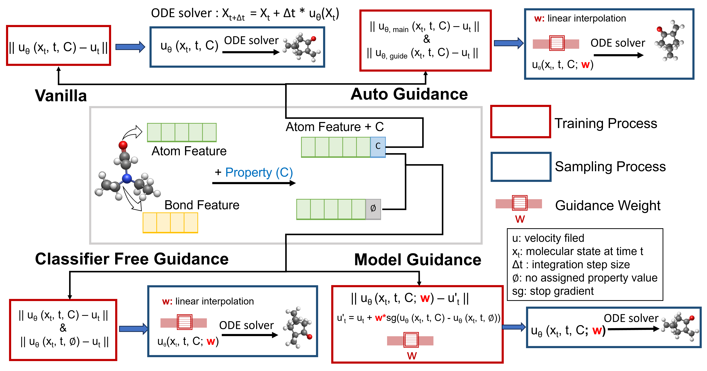

# MolGuidance

1. This molguidance framework is built on top of our previous work **[PropMolFlow](https://github.com/Liu-Group-UF/PropMolFlow)**.
<!-- 2. You can also clone this repoistory from branch from our **[PropMolFlow](https://github.com/Liu-Group-UF/PropMolFlow)** repoistory without the need to create an new environment if you installed propmolflow before. -->
2. What new here is that we implement different guidance methods and guidance format for conditonal flow matching framework. Moreover, we introudced a new dataset **[QMe14S](https://pubs.acs.org/doi/10.1021/acs.jpclett.5c00839)** beyond **QM9** to test the scalability of the our methods.


## Environment Setup
**Please Make Sure Cuda Version >= 12.8 and Already Installed Conda**

Run the following commands in your terminal to set up `molguidance` (We have tested it on **Nvidia L4 and Blackwell B200** GPUs): 
```python
conda create -n molguidance python=3.12 
conda activate molguidance
pip install torch==2.7.0 torchvision==0.22.0 torchaudio==2.7.0 --index-url https://download.pytorch.org/whl/cu128
pip install torch-cluster torch_scatter torch_sparse -f https://data.pyg.org/whl/torch-2.7.0%2Bcu128.html
pip install pytorch-lightning==2.5.2
pip install networkx==3.1
pip install einops==0.8.1 rdkit==2025.3.5 py3Dmol==2.5.2 useful-rdkit-utils==0.90 scikit-learn==1.7.1 scikit-optimize==0.10.2 posebusters==0.5.0
pip install torchtyping ase wandb 
conda install conda-forge::openbabel
conda install -c dglteam/label/th24_cu124 dgl=2.4.0.th24.cu124
pip install -e .
```
Or you can simply install all packages by 
```bash
# make sure clone the repo first, and cd MolGuidance, so conda can run "pip install -e ." without error
conda env create -f environment.yml
```

## Preprocessing for Dataset 
### QM9
#### Download
We provide a corrected version of the QM9 SDF file originally from [DeepChem](https://github.com/deepchem/deepchem), fixing issues such as **invalid bond orders** and **non-zero net charges** in approximately **30,000 molecules**.

To download the revised SDF file, run:
```bash
wget https://zenodo.org/records/15700961/files/all_fixed_gdb9.zip
unzip all_fixed_gdb9.zip
rm all_fixed_gdb9.zip
```
After downloading, move the **all_fixed_gdb9.sdf** file to the `data/qm9_raw/` directory:
```bash
mv all_fixed_gdb9.sdf data/qm9_raw/
```
The revised SDF file is also hosted at our HuggingFace [ColabFit rQM9](https://huggingface.co/datasets/colabfit/rQM9).

#### Generate Training, Validation, Testing Data
```bash
python process_qm9_cond.py --config=configs/qm9/alpha/qm9_vanilla.yaml
```

### QMe14S
#### Download
We provide a cleaned SDF file of QMe14S where bonds information are first guessed by [Open Babel](https://github.com/openbabel/openbabel) then fixed for some unreasonable molecules' bond information. 

To download the revised SDF file, run:
```bash
wget https://zenodo.org/records/16847162/files/cleaned_qme14s.sdf.zip
unzip cleaned_qme14s.sdf.zip
rm cleaned_qme14s.sdf.zip.zip
```
After downloading, move the **all_fixed_gdb9.sdf** file to the `data/qm9_raw/` directory:
```bash
mv cleaned_qme14s.sdf.zip data/qme14s_raw/
```
#### Generate Training, Validation, Testing Data
```bash
python process_qme14s_cond.py --config=configs/qme14s/mu/qme14s_vanilla.yaml
```

## Checkpoints
All the trained model checkpoints can be found at our [Zenodo repository](https://zenodo.org/records/16847162). Can aslo get it by running:
```bash
wget https://zenodo.org/records/16847162/files/checkpoints.zip
unzip checkpoints.zip
rm checkpoints.zip
```

## Vanilla Model
### Training
Train a PropMolFlow model without guidance. 
#### QM9 (take property alpha as example)
```python
# training from scratch
python train.py --config=configs/qm9/alpha/qm9_vanilla.yaml

# continue training from checkpoints
python train.py --resume=checkpoints/qm9/alpha/vanilla/epoch=1758-step=687612.ckpt
```
#### QMe14S (take property mu as example)
```python
# training from scratch
python train.py --config=configs/qme14s/mu/qme14s_vanilla.yaml

# continue training from checkpoints
python train.py --resume=checkpoints/qme14s/mu/vanilla/epoch=1621-step=887232.ckpt
```

### Sampling
#### QM9 (take property alpha as example) 
```python
python sample_condition.py --model_checkpoint "checkpoints/qm9/alpha/vanilla/epoch=1758-step=687612.ckpt" --n_mols 1000 --max_batch_size 128 --n_timesteps 100 --properties_handle_method "concatenate_sum" --multilple_values_file "sampling_input/qm9/in_distribution_sampling/train_half_sampled_values_alpha.npy" --property_name "alpha" --number_of_atoms "sampling_input/qm9/in_distribution_sampling/train_half_sampled_no_atoms_alpha.npy" --normalization_file_path "data/qm9/train_data_property_normalization.pt" --output_file "sampling_result/qm9/alpha/vallina.sdf" --analyze
```
#### QMe14S (take property mu as example)
```python
python sample_condition.py --model_checkpoint "checkpoints/qme14s/mu/vanilla/epoch=1621-step=887232.ckpt" --n_mols 1000 --max_batch_size 128 --n_timesteps 100 --properties_handle_method "concatenate_sum" --multilple_values_file "sampling_input/qme14s/in_distribution_sampling/train_half_sampled_values_mu.npy" --number_of_atoms "sampling_input/qme14s/in_distribution_sampling/train_half_sampled_no_atoms_mu.npy" --normalization_file_path "data/qme14s/train_data_property_normalization.pt" --output_file "sampling_result/qme14s/mu/vallina.sdf" --analyze
```

## Classifer-Free Guidance 
### Training
#### QM9 (take property alpha as example)
```python
# training from scratch
python train_with_guidance.py --config=configs/qm9/alpha/qm9_cfg.yaml

# continue training from checkpoints
python train_with_guidance.py --resume=checkpoints/qm9/alpha/classifier_free_guidance/epoch=1900-step=742978.ckpt
```
#### QMe14S (take property mu as example)
```python
# training from scratch
python train_with_guidance.py --config=configs/qme14s/mu/qme14s_cfg.yaml

# continue training from checkpoints
python train_with_guidance.py --resume=checkpoints/qme14s/mu/classifier_free_guidance/epoch=1598-step=874215.ckpt
```

### Sampling with Different Guidance Format
#### guidance on probability with linear format
```python
# QM9 with guidance weight = 1.5 for alpha
python sample_cfg.py --model_checkpoint "checkpoints/qm9/alpha/classifier_free_guidance/epoch=1900-step=742978.ckpt" --n_mols 10000 --max_batch_size 128 --n_timesteps 100 --properties_handle_method "concatenate_sum" --multilple_values_file "sampling_input/qm9/in_distribution_sampling/train_half_sampled_values_alpha.npy" --number_of_atoms "sampling_input/qm9/in_distribution_sampling/train_half_sampled_no_atoms_alpha.npy" --property_name "alpha" --normalization_file_path "data/qm9/train_data_property_normalization.pt" --guide_w_x 1.5 --guide_w_a 1.5 --guide_w_c 1.5 --guide_w_c 1.5 --dfm_type "campbell_rate_matrix" --guidance_format "linear" --where_to_apply_guide "probabilities" --output_file "sampling_result/qm9/probability_linear/cfg.sdf" --analyze

# QMe14S with guidance weight = 1.5
python sample_cfg.py --model_checkpoint "checkpoints/qme14s/mu/classifier_free_guidance/epoch=1598-step=874215.ckpt" --n_mols 10000 --max_batch_size 128 --n_timesteps 100 --properties_handle_method "concatenate_sum" --multilple_values_file "sampling_input/qme14s/in_distribution_sampling/train_half_sampled_values_mu.npy" --number_of_atoms "sampling_input/qme14s/in_distribution_sampling/train_half_sampled_no_atoms_mu.npy" --normalization_file_path "data/qme14s/train_data_property_normalization.pt" --guide_w_x 1.5 --guide_w_a 1.5 --guide_w_c 1.5 --guide_w_c 1.5 --dfm_type "campbell_rate_matrix" --guidance_format "linear" --where_to_apply_guide "probabilities" --output_file "sampling_result/qme14sprobability_linear/probability_linear/cfg.sdf" --analyze
```

#### guidance on probability with log format
```python
# QM9 with guidance weight = 1.5 for alpha
python sample_cfg.py --model_checkpoint "checkpoints/qm9/alpha/classifier_free_guidance/epoch=1900-step=742978.ckpt" --n_mols 10000 --max_batch_size 128 --n_timesteps 100 --properties_handle_method "concatenate_sum" --multilple_values_file "sampling_input/qm9/in_distribution_sampling/train_half_sampled_values_alpha.npy" --number_of_atoms "sampling_input/qm9/in_distribution_sampling/train_half_sampled_no_atoms_alpha.npy" --property_name "alpha" --normalization_file_path "data/qm9/train_data_property_normalization.pt" --guide_w_x 1.5 --guide_w_a 1.5 --guide_w_c 1.5 --guide_w_c 1.5 --dfm_type "campbell_rate_matrix" --guidance_format "log" --where_to_apply_guide "probabilities" --output_file "sampling_result/qm9/probability_log/cfg.sdf" --analyze

# QMe14S with guidance weight = 1.5
python sample_cfg.py --model_checkpoint "checkpoints/qme14s/mu/classifier_free_guidance/epoch=1598-step=874215.ckpt" --n_mols 10000 --max_batch_size 128 --n_timesteps 100 --properties_handle_method "concatenate_sum" --multilple_values_file "sampling_input/qme14s/in_distribution_sampling/train_half_sampled_values_mu.npy" --number_of_atoms "sampling_input/qme14s/in_distribution_sampling/train_half_sampled_no_atoms_mu.npy" --normalization_file_path "data/qme14s/train_data_property_normalization.pt" --guide_w_x 1.5 --guide_w_a 1.5 --guide_w_c 1.5 --guide_w_c 1.5 --dfm_type "campbell_rate_matrix" --guidance_format "log" --where_to_apply_guide "probabilities" --output_file "sampling_result/qme14s/probability_log/cfg.sdf" --analyze
```
#### guidance on rate matrix with linear format
```python
# QM9 with guidance weight = 1.5 for alpha
python sample_cfg.py --model_checkpoint "checkpoints/qm9/alpha/classifier_free_guidance/epoch=1900-step=742978.ckpt" --n_mols 10000 --max_batch_size 128 --n_timesteps 100 --properties_handle_method "concatenate_sum" --multilple_values_file "sampling_input/qm9/in_distribution_sampling/train_half_sampled_values_alpha.npy" --number_of_atoms "sampling_input/qm9/in_distribution_sampling/train_half_sampled_no_atoms_alpha.npy" --property_name "alpha" --normalization_file_path "data/qm9/train_data_property_normalization.pt" --guide_w_x 1.5 --guide_w_a 1.5 --guide_w_c 1.5 --guide_w_c 1.5 --dfm_type "campbell_rate_matrix" --guidance_format "linear" --where_to_apply_guide "rate_matrix" --output_file "sampling_result/qm9/rate_matrix_linear/cfg.sdf" --analyze

# QMe14S with guidance weight = 1.5
python sample_cfg.py --model_checkpoint "checkpoints/qme14s/mu/classifier_free_guidance/epoch=1598-step=874215.ckpt" --n_mols 10000 --max_batch_size 128 --n_timesteps 100 --properties_handle_method "concatenate_sum" --multilple_values_file "sampling_input/qme14s/in_distribution_sampling/train_half_sampled_values_mu.npy" --number_of_atoms "sampling_input/qme14s/in_distribution_sampling/train_half_sampled_no_atoms_mu.npy" --normalization_file_path "data/qme14s/train_data_property_normalization.pt" --guide_w_x 1.5 --guide_w_a 1.5 --guide_w_c 1.5 --guide_w_c 1.5 --dfm_type "campbell_rate_matrix" --guidance_format "linear" --where_to_apply_guide "rate_matrix" --output_file "$sampling_result/qme14s/rate_matrix_linear/cfg.sdf" --analyze
```
#### guidance on rate matrix with log format
```python
# QM9 with guidance weight = 1.5 for alpha
python sample_cfg.py --model_checkpoint "checkpoints/qm9/alpha/classifier_free_guidance/epoch=1900-step=742978.ckpt" --n_mols 10000 --max_batch_size 128 --n_timesteps 100 --properties_handle_method "concatenate_sum" --multilple_values_file "sampling_input/qm9/in_distribution_sampling/train_half_sampled_values_alpha.npy" --number_of_atoms "sampling_input/qm9/in_distribution_sampling/train_half_sampled_no_atoms_alpha.npy" --property_name "alpha" --normalization_file_path "data/qm9/train_data_property_normalization.pt" --guide_w_x 1.5 --guide_w_a 1.5 --guide_w_c 1.5 --guide_w_c 1.5 --dfm_type "campbell_rate_matrix" --guidance_format "log" --where_to_apply_guide "rate_matrix" --output_file "$sampling_result/qm9/rate_matrix_log/cfg.sdf" --analyze

# QMe14S with guidance weight = 1.5
python sample_cfg.py --model_checkpoint "checkpoints/qme14s/mu/classifier_free_guidance/epoch=1598-step=874215.ckpt" --n_mols 10000 --max_batch_size 128 --n_timesteps 100 --properties_handle_method "concatenate_sum" --multilple_values_file "sampling_input/qme14s/in_distribution_sampling/train_half_sampled_values_mu.npy" --number_of_atoms "sampling_input/qme14s/in_distribution_sampling/train_half_sampled_no_atoms_mu.npy" --normalization_file_path "data/qme14s/train_data_property_normalization.pt" --guide_w_x 1.5 --guide_w_a 1.5 --guide_w_c 1.5 --guide_w_c 1.5 --dfm_type "campbell_rate_matrix" --guidance_format "log" --where_to_apply_guide "rate_matrix" --output_file "$sampling_result/qme14s/rate_matrix_log/cfg.sdf" --analyze
```

## Autoguidance
We use vanilla model as good model, and then train a inferior model to guide the vanilla model towards the direction with good property alignment. Here we only show the example autoguidance on probability with log format.   
### Training
#### QM9 (take property alpha as example)
```python
# training the inferor model from scratch
python train.py --config=configs/qm9/alpha/qm9_inferior.yaml
```
#### QMe14S (take property mu as example)
```python
# training the inferor model from scratch
python train.py --config=configs/qme14s/mu/qme14s_inferior.yaml
```
### Sampling
#### QM9 (take property alpha as example) 
```python
python sample_ag.py --good_model_checkpoint "checkpoints/qm9/alpha/vanilla/epoch=1758-step=687612.ckpt" --bad_model_checkpoint "checkpoints/qm9/alpha/auto_guidance/model-step=step=40000.ckpt" --n_mols 10000 --max_batch_size 128 --n_timesteps 100 --properties_handle_method "concatenate_sum" --multilple_values_file "sampling_input/qm9/in_distribution_sampling/train_half_sampled_values_alpha.npy" --number_of_atoms "sampling_input/qm9/in_distribution_sampling/train_half_sampled_no_atoms_alpha.npy" --property_name "alpha" --normalization_file_path "data/qm9/train_data_property_normalization.pt" --guide_w_x 1.5 --guide_w_a 1.5 --guide_w_c 1.5 --guide_w_c 1.5 --dfm_type "campbell_rate_matrix" --guidance_format "log" --where_to_apply_guide "probabilities" --output_file "sampling_result/qm9/probability_log/ag.sdf" --analyze
```
#### QMe14S (take property mu as example)
```python
python sample_ag.py --good_model_checkpoint "checkpoints/qme14s/mu/vanilla/epoch=1621-step=887232.ckpt" --bad_model_checkpoint "checkpoints/qme14s/mu/auto_guidance/model-step=step=40000.ckpt" --n_mols 10000 --max_batch_size 128 --n_timesteps 100 --properties_handle_method "concatenate_sum" --multilple_values_file "sampling_input/qme14s/in_distribution_sampling/train_half_sampled_values_mu.npy" --number_of_atoms "sampling_input/qme14s/in_distribution_sampling/train_half_sampled_no_atoms_mu.npy" --normalization_file_path "data/qme14s/train_data_property_normalization.pt" --guide_w_x 1.5 --guide_w_a 1.5 --guide_w_c 1.5 --guide_w_c 1.5 --dfm_type "campbell_rate_matrix" --guidance_format "log" --where_to_apply_guide "probabilities" --output_file "sampling_result/qme14s/probability_log/ag.sdf" --analyze
```

## Model Guidance 
### Training
#### QM9 (take property alpha as example)
```python
# training from scratch
python train_with_guidance.py --config=configs/qm9/alpha/qm9_mg.yaml

# continue training from checkpoints
python train_with_guidance.py --resume=checkpoints/qm9/alpha/model_guidance/epoch=1651-step=645775.ckpt
```
#### QMe14S (take property mu as example)
```python
# training from scratch
python train_with_guidance.py --config=configs/qme14s/mu/qme14s_mg.yaml

# continue training from checkpoints
python train_with_guidance.py --resume=checkpoints/qme14s/mu/model_guidance/epoch=1990-step=1088639.ckpt
```
### Sampling
#### QM9 (take property alpha as example) 
```python
python sample_mg.py --model_checkpoint "checkpoints/qm9/alpha/model_guidance/epoch=1651-step=645775.ckpt" --n_mols 10000 --max_batch_size 128 --n_timesteps 100 --properties_handle_method "sum" --multilple_values_file "sampling_input/qm9/in_distribution_sampling/train_half_sampled_values_alpha.npy" --number_of_atoms "sampling_input/qm9/in_distribution_sampling/train_half_sampled_no_atoms_alpha.npy" --property_name "alpha" --normalization_file_path "data/qm9/train_data_property_normalization.pt" --guide_wight 1.5 --output_file "sampling_result/qm9/probability_log/mg.sdf" --analyze
```
#### QMe14S (take property mu as example)
```python
python sample_mg.py --model_checkpoint "checkpoints/qme14s/mu/model_guidance/epoch=1990-step=1088639.ckpt" --n_mols 10000 --max_batch_size 128 --n_timesteps 100 --properties_handle_method "sum" --multilple_values_file "sampling_input/qme14s/in_distribution_sampling/train_half_sampled_values_mu.npy" --number_of_atoms "sampling_input/qme14s/in_distribution_sampling/train_half_sampled_no_atoms_mu.npy" --normalization_file_path "data/qme14s/train_data_property_normalization.pt" --guide_wight 1.5 --output_file "sampling_result/qme14s/probability_log/mg.sdf" --analyze
```

## Bonous: Classifier Guidance 
We didn't include classifier guidance in our main paper due to the poor performance compared with CFG and the extra training cost of the classifier. However, we still provide the code for training the classifier here for reader's interest.

 - The training code for classifier is on `modelguidance/classifier`
 - The sampling code with classifier guidance is on `sample_cg.py`

## Bayesian Optimization with Molguidance
We provide how we use Molguidance for Bayesian Optimization in the `bayesian` folder. Please refer to the `README.md` file in that folder for more details.

## Acknowledgements

Molguidance builds upon the source code from the following projects:
* [FlowMol](https://github.com/Dunni3/FlowMol)
* [Mattergen](https://github.com/microsoft/mattergen)
* [EDM2](https://github.com/NVlabs/edm2)
* [Diffusion-wo-CFG](https://github.com/tzco/Diffusion-wo-CFG)
* [Discrete_Guidance](https://github.com/hnisonoff/discrete_guidance)

